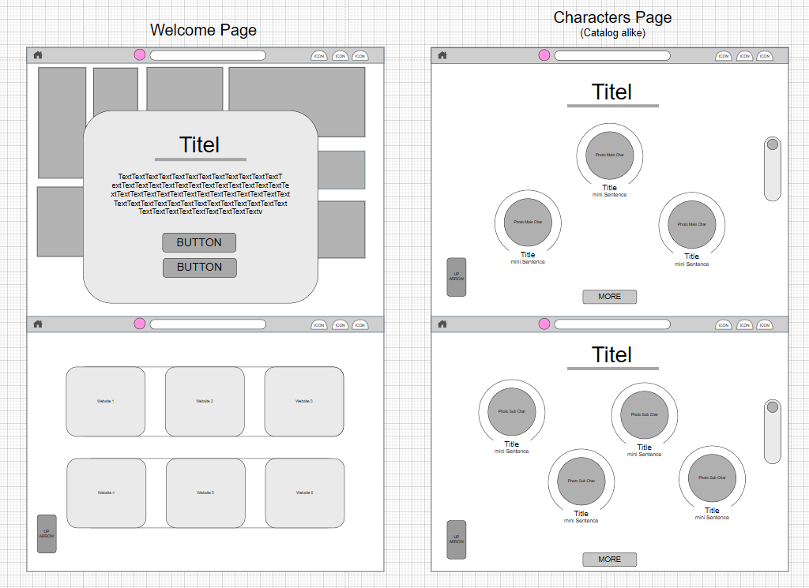

# Grundaufbau

### a) Projektdefinition 

> *Als Gruppe überlegen sie sich ein Projekt, welches sie als HTML-Seite umsetzen möchte. Ihr Projekt muss in 2-5 Sätzen beschrieben werden, so dass ein Leser weiss was ihn erwartet.*

"Mein Projekt ist eine Website über Chiikawa, eine beliebte japanische Charakterserie. Auf der Seite stelle ich Informationen zur Show, zu den Charakteren und vieles mehr bereit."

---
### b) Wireframes
> *Erstellen sie nun Wireframes von ihren beiden Inhaltstypen. Es muss klar werden wo sich folgende Elemente befinden: Header, Footer, Inhalt (in welcher Breite mit Platzhalter), Navigation, Logo.*

#### Wireframe: Welcome-Page and Characters Page ⋆˚꩜｡

---

### c) Styleguide 

#### Logo: 
- File-Path: `/Assets/logo.png`
- Placemet: Left from the 'Search Bar', **pink circle 🩷**.
- Format and Size: Small and round like transparent .png
- How it looks like:

---

#### Typography

| Verwendung             | Schriftart | Grösse | Gewicht  | Farbe            |
| ---------------------- | ---------- | ------ | -------- | ---------------- |
| **Haupttitel (h1)**    | Baloo 2    | 32–40 px | Bold     | `#272727`        |
| **Untertitel (h2/h3)** | Baloo 2    | 24–28 px | SemiBold | `#272727`        |
| **Fliesstext**          | Quicksand  | 16–18 px | Regular  | `#494747`        |
| **Buttons**            | Baloo 2    | 16–20 px | Bold     | `#494747` (Text) |
| **Kleingedrucktes**    | Quicksand  | 14 px    | Light    | `#494747`        |

❗ **Textfarbe:** `#494747` für den Grossteil des Textes – es ist weicher als Schwarz und passt gut zu der Rosa-Palette. Für Titel wird `#272727` verwendet für besseren Kontrast.

---
| Element       | Beschreibung                    | Farbcode  |
| ------------- | ------------------------------- | --------- |
| Hintergrund   | Weisser Hintergrund              | `#FFFFFF` |
| Primärfarbe   | Soft Pink   | `#F8C7D2` |
| Sekundärfarbe | Pale Pink      | `#FFD8E2` |
| Akzentfarbe 1 | Rose Pink    | `#FFBBCC` |
| Akzentfarbe 2 | Blush Pink   | `#FFC5D9` |
| Textfarbe     | Dunkelgrau | `#494747` |
| Rahmenlinien  | Hellgrau   | `#FFE2E9` |
---

### d) Template-Seiten
> *Nachdem nun klar ist wie die beiden Inhaltsseiten aussehen sollen, bilden sie die beiden Wireframes in HTML ab, ohne konkreten Inhalt zu erstellen. Platzieren sie die Container an den korrekten Orten. Verwenden sie dabei eines der drei Frameworks: Grid, Flexbox, Positional Layout. Mit allen drei können sie die Header, Footer, etc korrekt platzieren. Sie dürfen auch mischen, falls dies notwendig sein sollte*.
>
> *Verwendenden sie für die Rasteransicht ein anderes Framework (Grid, Flexbox, Positional Layout, flow Layout) als sie für ihre Struktur (Header, Footer, etc) verwendet haben.*

[Path to my Template](/Templates/HTML) *(Ausserdem habe ich Javascript hinzugefügt, um bereits zu wissen, wie die Site-Koordinaten sein werden)

---

### e) Inhaltsseiten
> *Erstellen sie nun die Inhaltsseiten. Dafür kopieren sie die Templates in den Ordner "Site" und erweitern nur noch die Inhalte. Erstellen sie folgende Inhaltsseiten:*
> 
> *- Projekt-Einstiegsseite: Beschreiben sie kurz den Inhalt. Verwenden sie ein Bild als Unterstützung. Lassen sie den Text um das Bild fliessen. Sie können Bilder von der Plattform unsplash.com oder andere freien Webseiten verwenden. Verwenden sie das erste Template.*
>
> *- Eine About-Us Seite: Beschreiben sie sich kurz mit einer Liste von Eigenschaften (z.B. Name Hobby, Arbeits- und/oder Schulort, etc). Verwenden sie die korrekten Listen-Tags. Verwenden sie auch hier wieder Bilder von ihnen oder Avataren, die sie darstellen sollen. Schauen sie auf die Darstellung und überlegen sie sich wie sie sich darstellen möchten. Beispiele finden sie im Internet viele. Verwenden sie das erste Template.*
>
> *-> Erstellen sie eine dritte Seite auf der sie ihre Teams, Produkte, etc darstellen. Verwenden sie hier das zweite Template.*
>
> *Verwenden sie jeweils Hex-Tags (h1, h2, etc) für Titel und Untertitel und Paragraphen für Texte.*

**ON IT. AAAAAAAAAAAAAAAAAAAAAAAAAAAAAAAAAAA**

---

### f) Publikation

> *Publizieren sie die Inhalte auf einer FTP-Seite. Von der Lehrperson haben sie einen Zugang auf einen FTP bekommen. Verwenden sie diesen Zugang und publizieren sie die Seite dort. Via HTTP sollte die Seite nun verfügbar sein.*

- Ask teacher how to do it.